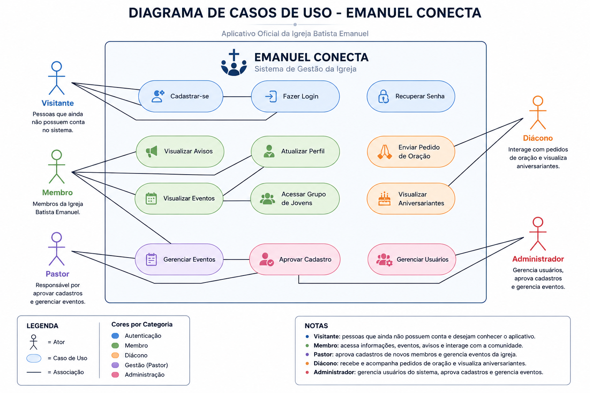

## 📘 Diagrama de Casos de Uso

## Objetivo

Representar graficamente os atores e as funcionalidades do sistema Emanuel Conecta.

## Ferramenta

Draw.io (diagrams.net)

## Diagrama

## Atores

- **Visitante**
- **Membro**
- **Pastor**
- **Diácono**
- **Administrador**
